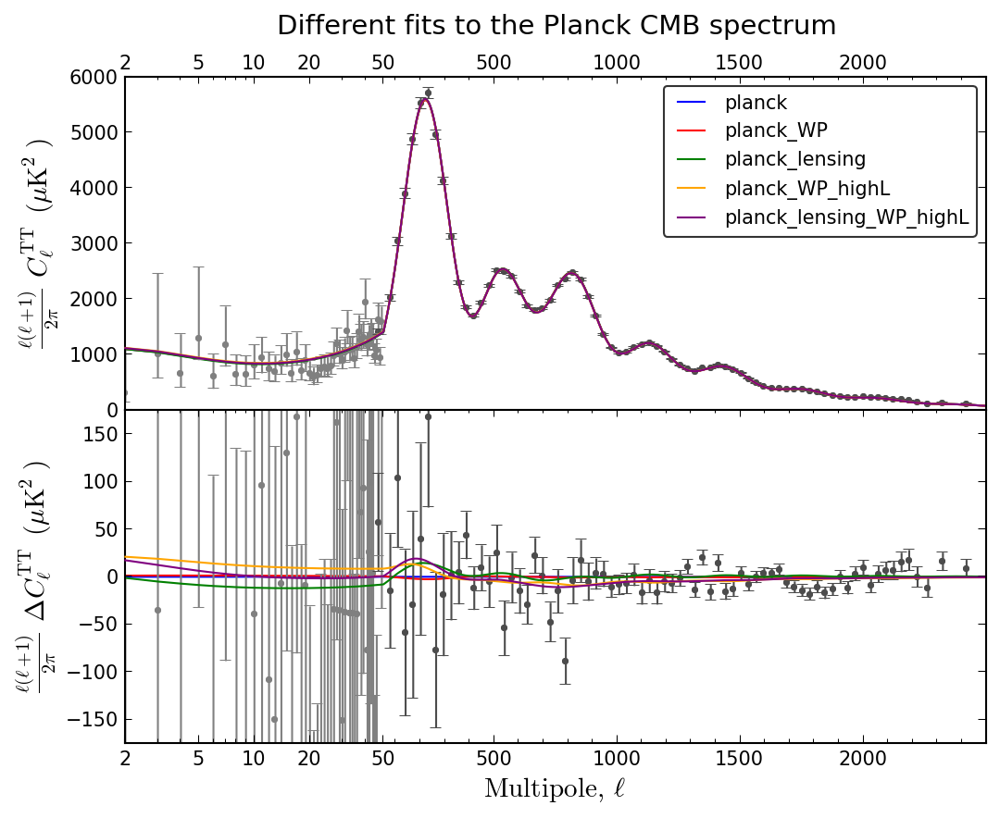
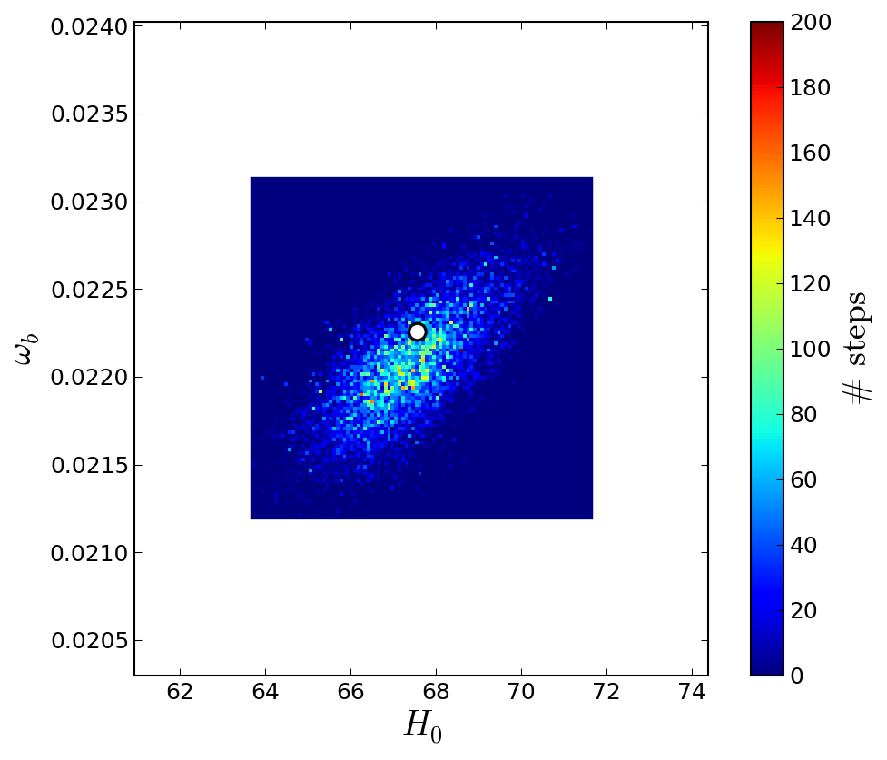
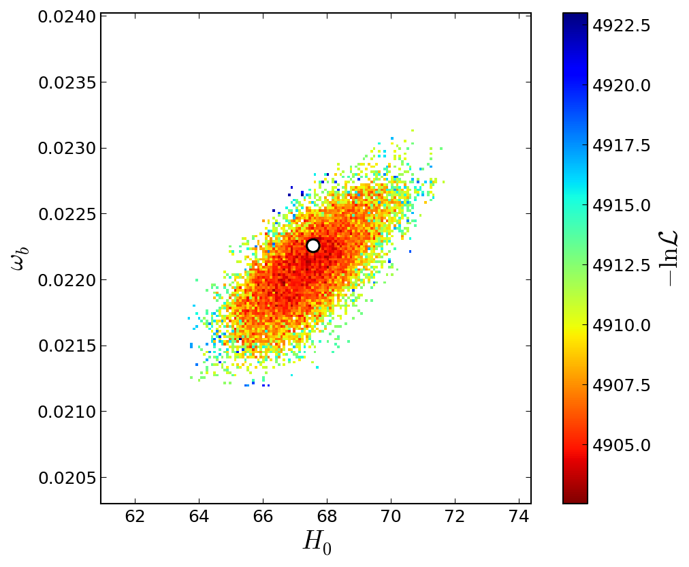

# `cosmo_mini_toolbox` README

**Author**: Jesús Torrado ([personal web page](http://www.lorentz.leidenuniv.nl/~torradocacho/))

Small (but growing) set of tools for manipulating cosmological data and statistical results, and for generating publication-quality plots (used, e.g, in [arXiv:1311.2552](http://arxiv.org/abs/1311.2552)).

All the tools are intended to use products of the two most famous cosmological-code/sampler tandems, [CLASS](http://class-code.net/)+[MontePython](http://montepython.net/) and [CAMB](http://camb.info/)+[CosmoMC](http://cosmologist.info/cosmomc/), so that most of the operations can be done independently of the origin of the product.

Requires:
* `numpy` (minimal version tested: 1.6.1)
* `matplotlib` (minimal version tested: 1.2.1)
* For the likelihood calculation, the ESA Planck's likelihood code (see [here](http://pla.esac.esa.int/pla/aio/planckProducts.html))

## Overview and examples of the modules

### CMBspectrum.py

A class that stores a CMB power spectrum generated from `CLASS` or `CAMB`, and allows to recover the data in a way independent from the code that generated it.

It is used by the spectrum plotter tool `plot_Cl_CMB` and by the likelihood calculation `Likelihood_Planck`.

### plot_Cl_CMB.py

A tool to plot (absolute) comparisons between different CMB spectra.

#### Example

The code in `examples/plot_Cl_CMB_example.py` generates the following plot:

#### TODO

* Add Planck data points

### Chain.py

Class for manipulating chains and getting info from them, independently from the code that generated them.

It is used by the likelihood plotter `plot_lik`.

### plot_lik.py

Plots the [marginal, mean, profile] likelihood of the given chains with respect to the given parameters, on a grid, meaning
* Mean:     `(sum_i #_i * -loglik_i) / (sum_i #_i)`
* Marginal: `sum_i #_i`
* Profile:  `max(-loglik_i)`
being the sums over `i` extended to all chain points falling within a given cell, and being `#_i` the number of stops of the chain point `i`.

#### Example

The code in `examples/likelihood_example.py` generates the following plots, for the MCMC-approximated *marginal* likelihood and its profile:

#### TODO

* Fix padding (specially negative parameters)
* Fix small issue with the best fit points

### Likelihood_Planck.py

A class for calculating log-likelihoods.

Once initialised, the method 'Likelihood_Planck.get_loglik(spectrum)' can be called any number of times for different 'spectrum' (instances of 'CMBspectrum').

#### Example

The code in `examples/likelihood_example.py` generates the following output:

    ----
    clik version 5887
    gibbs d462e865-e178-449a-ac29-5c16ab9b38f5
    Checking likelihood '/home/torradocacho/cosmo/data/planck/likelihood/commander_v4.1_lm49.clik' on test data. got 3.2784 expected 3.2784 (diff -2.5556e-10)
    ----
    ----
    clik version 5887
    CAMspec e61cec87-3a37-43ca-8ed1-edcfcaf5c00a
    Checking likelihood '/home/torradocacho/cosmo/data/planck/likelihood/CAMspec_v6.2TN_2013_02_26_dist.clik' on test data. got -3908.71 expected -3908.71 (diff -3.66231e-08)
    ----
    Initializing Planck low-likelihood, version v2.1
    ----
    clik version 5887
    lowlike "lowlike v222"
    Checking likelihood '/home/torradocacho/cosmo/data/planck/likelihood/lowlike_v222.clik' on test data. got -1007.04 expected -1007.04 (diff -2.0215e-05)
    ----
    *** Computing : commander_v4.1_lm49.clik
    loglik  =  [ 3.29746278]
    chi2eff =  [-6.59492557]
    *** Computing : CAMspec_v6.2TN_2013_02_26_dist.clik
    loglik  =  [-3897.5980409]
    chi2eff =  [ 7795.1960818]
    *** Computing : lowlike_v222.clik
    loglik  =  [-1007.24552052]
    chi2eff =  [ 2014.49104104]
    *** TOTAL :
    loglik  =  -4901.54609864
    chi2eff =  9803.09219727

### PlanckLogLinearScale.py

An experimental implementation of the log+linear scale used to plot the CMB power spectrum by the ESA Planck team.

#### TODO:

* fix localisation in the matplotlib GUI
* Manually change the aspect ratio
* Automatic ticks
* 'change' and 'factor' parameters to be set manually, not hard coded
* Document

## License

**GPL3** (see the `LICENSE` file).
